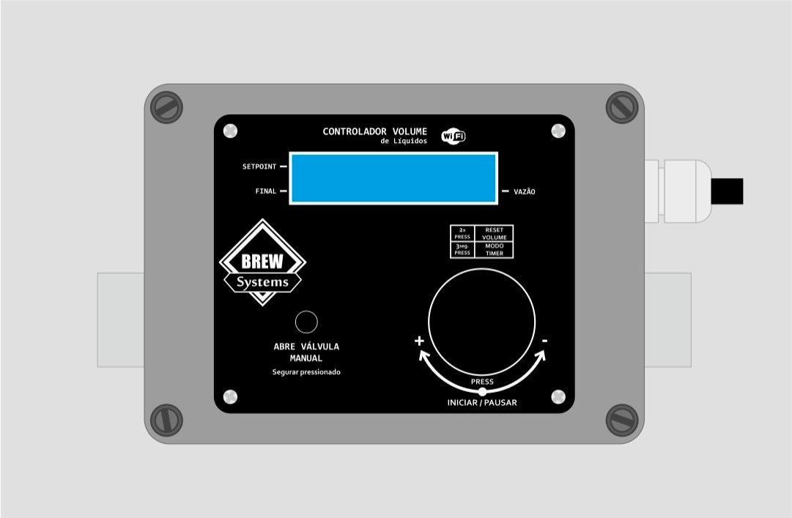
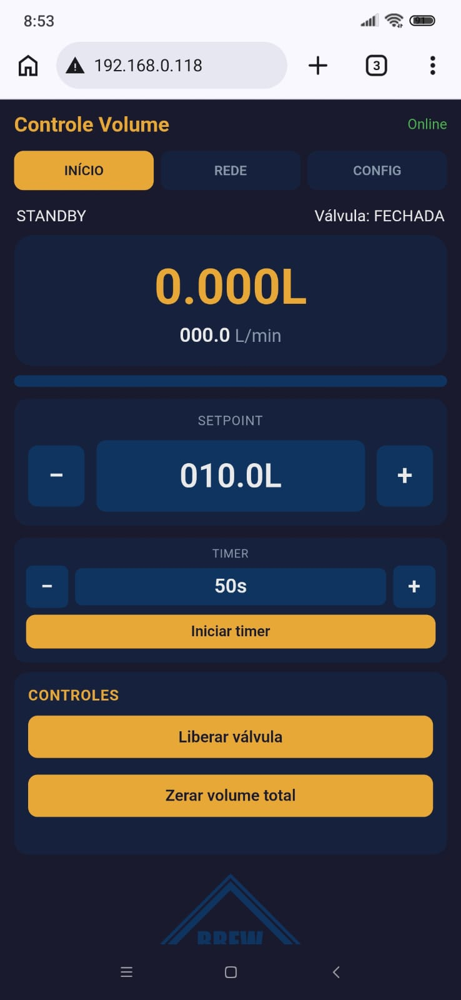

# Manual de Operação — Litrero

**Controle automático de volume de líquidos**  
BREW Systems · MAZZA

---

## 1. Apresentação

O **Litrero** é um controlador inteligente de enchimento que mede o volume de líquido em tempo real e comanda a válvula solenoide automaticamente. O equipamento foi projetado para processos que exigem **precisão repetível**, **segurança operacional** e **facilidade de uso** — no painel físico ou pelo celular/computador.



---

## 2. Principais vantagens

| Vantagem | O que isso significa na prática |
|----------|----------------------------------|
| **Medição precisa de volume** | O sensor de fluxo integra litros passados com resolução adequada ao setpoint; o enchimento para exatamente no volume programado. |
| **Controle automático** | Basta definir o volume desejado e iniciar; a válvula abre, monitora a vazão e fecha ao atingir o alvo. |
| **Monitoramento de vazão (L/min)** | A leitura contínua permite ajustar pressão/bomba ou válvula para manter fluxo estável — essencial para **filtros funcionarem de forma efetiva** |
| **Operação local e remota** | Display LCD + encoder no equipamento; interface web no celular com atualização em tempo real. |
| **Timer de enchimento** | Agende o início automático após um tempo de espera (útil em processos que precisam de repouso antes da inicialização). |
| **Proteções de segurança** | Watchdogs detectam ausência de fluxo ou enchimento excessivamente longo e fecham a válvula automaticamente. |
| **Estatísticas** | Contagem de ciclos e litros acumulados para acompanhamento de produção. |
| **Atualização sem desmontar** | Firmware atualizável via OTA (Over-The-Air) pela interface web. |

---

## 3. Visão geral do painel

### 3.1 Display LCD (16 × 2)

Na operação normal, o display mostra:

| Linha | Conteúdo |
|-------|----------|
| **Superior** | **Setpoint** (volume alvo, em litros) · indicador **L/min** |
| **Inferior** | **Volume atual** acumulado · **Vazão instantânea** (L/min) |

Exemplo conceitual:

```
 20.0L     L/min
  8.5L    012.3
```

- **Setpoint** (topo, esquerda): volume que se deseja encher.
- **Volume atual** (baixo, esquerda): litros já transferidos no ciclo em andamento.
- **Vazão** (baixo, direita): fluxo instantâneo — use para calibrar bomba/pressão e validar o comportamento do filtro.

O backlight desliga após **2 minutos** sem interação e religa ao girar o encoder ou pressionar botões.

### 3.2 Encoder rotativo (botão + rotação)

| Gesto | Função |
|-------|--------|
| **Girar** | Ajusta o setpoint de volume (em STANDBY, ENCHENDO ou PAUSADO) |
| **Clique** | Inicia enchimento · Pausa · Retoma · Confirma ações no backend/timer |
| **Duplo clique** | Entra no modo **zerar** (setpoint ou volume total piscam) |
| **Pressionar 2 s** | Entra no **menu backend** (STANDBY/ERRO) · Sai do timer · Sai do backend |

**Passos de ajuste do setpoint** (rotação lenta):

| Faixa do setpoint | Incremento por passo |
|-------------------|----------------------|
| &lt; 1 L | 0,01 L |
| 1 L a 5 L | 0,1 L |
| 5 L a 10 L | 0,5 L |
| ≥ 10 L | 1,0 L |

Girar **mais rápido** aumenta o passo (até 5× o valor base) para ajustes ágeis em volumes grandes.

### 3.3 Botão manual (GPIO0)

Pressionar e **manter** o botão manual abre a válvula em **modo manual** (sem contagem automática de ciclo completo). Solte para fechar. Útil para purgas, testes ou fluxo contínuo curto.

Em estado de **ERRO**, pressionar o botão manual também permite **limpar o erro** e voltar ao STANDBY.

---

## 4. Operação básica — enchimento automático

### Passo a passo

1. **Ligue** o equipamento e aguarde a inicialização no display.
2. **Gire o encoder** até o setpoint desejado (ex.: `20.0 L`). O setpoint deve ser **maior que zero** para iniciar.
3. **Posicione** mangueiras, válvulas auxiliares e filtro conforme o processo.
4. **Observe a vazão** no display ou na web antes/durante o enchimento — ajuste bomba ou pressão para manter fluxo estável dentro da faixa recomendada do seu filtro.
5. **Clique** no encoder para **iniciar** → estado **ENCHENDO**; a válvula abre e o volume começa a contar a partir de zero.
6. Ao atingir o setpoint, a válvula **fecha automaticamente**, o ciclo encerra e um **pulso no optoacoplador** sinaliza conclusão (integração com outros equipamentos, se aplicável).
7. O equipamento retorna ao **STANDBY**, pronto para o próximo ciclo.

### Durante o enchimento

| Ação | Como fazer |
|------|------------|
| **Pausar** | Clique no encoder → estado **PAUSADO** (válvula fecha) |
| **Retomar** | Clique novamente → **ENCHENDO** (se ainda não atingiu o setpoint) |
| **Ajustar setpoint** | Gire o encoder (possível em ENCHENDO/PAUSADO) |
| **Zerar volume acumulado** | Duplo clique → selecione setpoint ou total (girar) → clique para zerar · duplo clique cancela |

---

## 5. Timer de enchimento

O timer inicia o enchimento automaticamente após uma contagem regressiva.

### Pelo painel (LCD)

1. Em **STANDBY**, pressione **simultaneamente** o **botão manual** e o **botão do encoder** por **2 segundos**.
2. O display mostra **TIMER OFF** e o tempo configurado.
3. **Gire o encoder** para ajustar o tempo:
   - Até 1 h: passos de **10 s**
   - Acima de 1 h: passos de **5 min**
4. **Clique** para iniciar a contagem (**TIMER ON**).
5. **Clique** novamente para **pausar** (**TIMER PAUSA**); clique para **retomar**.
6. **Pressione 2 s** o encoder para **cancelar** o timer e voltar ao STANDBY.
7. Ao chegar a **zero**, o enchimento inicia automaticamente (se setpoint &gt; 0).

### Pela interface web

Use o bloco **Timer** na aba **INÍCIO** (ajustar, iniciar, pausar, cancelar) — ver seção 8.

---

## 6. Menu backend (configuração no LCD)

Acesso: em **STANDBY** ou **ERRO**, **pressione o encoder por 2 segundos**.

| Item | Função |
|------|--------|
| **CALIB SENSOR** | Fator de calibração do sensor YF-S201 (padrão 7,5). Clique entra em edição; gire para ajustar; pressione 2 s para salvar. |
| **RESET STATS** | Zera ciclos e litros acumulados. Duplo clique → confirmar → clique. |
| **RESET WIFI** | Apaga rede Wi-Fi salva e reinicia. Duplo clique → confirmar → clique. |
| **REBOOT ESP** | Reinicia o controlador. Duplo clique → confirmar → clique. |
| **ERRO SEM FLUXO** | Timeout sem fluxo com válvula aberta (padrão 5 s, 1–60 s). |
| **ERRO ENCHIMENTO** | Timeout máximo de enchimento (padrão 20 min, 1–120 min). |

**Sair do backend:** pressione o encoder **2 segundos** (fora do modo edição).

---

## 7. Monitoramento de vazão e calibração

### Por que monitorar a vazão?

Filtros (cartucho, plate, lenticular, etc.) têm **faixa de fluxo recomendada**. Fluxo muito alto reduz eficiência e pode danificar o elemento filtrante; fluxo muito baixo prolonga o processo e altera o perfil de filtração.

O Litrero exibe **L/min em tempo real** no LCD e na interface web. Use essa leitura para:

- Ajustar velocidade da bomba ou pressão, ou fechamento da válvula após o controlador.
- Repetir enchimentos com **mesmo perfil de fluxo** entre lotes.
- Identificar entupimento parcial (queda de vazão com pressão constante).
- Validar calibração após manutenção no sensor ou nas mangueiras.

### Calibração do sensor

Sensor padrão: **YF-S201**. Relação teórica:

```
Frequência (Hz) ≈ 7,5 × Q (L/min)
Volume (L) = pulsos / fator_calibracao / 60
```

O fator padrão **7,5** pode ser ajustado no backend (LCD) ou na aba **CONFIG** da web. Compare volume indicado com medida de referência (balança ou recipiente graduado) e ajuste o fator até coincidir.

---

::: {.bloco-acesso-web}

## 8. Interface web

O controlador disponibiliza uma interface responsiva, otimizada para celular, com três abas principais.



### 8.1 Como acessar

1. Ligue o Litrero.
2. No celular ou computador, abra **Configurações → Wi-Fi**.
3. Conecte-se à rede do equipamento:

   | Campo | Valor |
   |-------|-------|
   | **Nome da rede (SSID)** | `Litrero` |
   | **Senha** | `brew*lit` |

4. Abra o navegador e acesse:

   ```
   http://192.168.4.1
   ```

5. O indicador **Online** (canto superior) confirma conexão WebSocket ativa — dados atualizados automaticamente a cada 0,5 s.

> **Obs.:** O equipamento mantém o ponto de acesso **Litrero** sempre ativo. Se uma rede externa (ex.: Wi-Fi da cervejaria) estiver configurada, o controlador opera em modo AP + STA e pode ser acessado também pelo IP da rede local (exibido na aba REDE após login).

:::

### 8.2 Segurança na conexão

A rede **Litrero** é **protegida por senha WPA2** (`brew*lit`), evitando que terceiros se conectem acidentalmente ou interceptem o controle do equipamento na cervejaria.

Camadas adicionais:

| Recurso | Proteção |
|---------|----------|
| **Rede Wi-Fi do equipamento** | SSID + senha obrigatórios |
| **Aba REDE** (scan e conexão a redes externas) | Login **HTTP Basic Auth** — usuário `Litrero`, senha `brew*lit` |
| **Abas INÍCIO e CONFIG** | Acessíveis após conectar na rede (operação do dia a dia) |
| **Sessão REDE** | Credenciais guardadas no navegador até fechar a aba/sessão |

**Boas práticas:**

- Não divulgue a senha `brew*lit` fora da equipe autorizada.
- Prefira rede **Litrero** dedicada ao equipamento durante operação; configure Wi-Fi externo apenas se necessário para integração.
- Após alterar configurações sensíveis, use **Reset Wi-Fi** (backend ou web) se suspeitar de acesso indevido.

### 8.3 Aba INÍCIO

| Elemento | Função |
|----------|--------|
| **Volume** | Litros acumulados no ciclo atual |
| **Fluxo (L/min)** | Vazão instantânea — monitore para ajuste de filtro/bomba |
| **Barra de progresso** | Proporção volume / setpoint |
| **Setpoint ±** | Ajuste fino do volume alvo |
| **Timer** | Configurar, iniciar, pausar e cancelar contagem regressiva |
| **Liberar válvula** | Equivalente ao clique do encoder (iniciar/pausar/retomar/limpar erro) |
| **Zerar volume total** | Zera contagem do ciclo atual |

Estados exibidos: STANDBY, ENCHENDO, PAUSADO, TIMER, ERRO SEM FLUXO, ERRO TIMEOUT, etc.

### 8.4 Aba REDE

Requer login (**Litrero** / **brew*lit**).

| Função | Descrição |
|--------|-----------|
| **Status** | IP do AP (`192.168.4.1`) ou IP na rede externa quando conectado |
| **Buscar** | Scan de redes Wi-Fi disponíveis |
| **Conectar** | Associa o equipamento a uma rede externa (informe a senha da rede escolhida) |

Use esta aba para integrar o controlador à rede fixa da cervejaria mantendo o AP **Litrero** ativo como fallback.

### 8.5 Aba CONFIG

| Campo | Descrição |
|-------|-----------|
| **Calib. sensor** | Fator de calibração (1,0 – 20,0) |
| **ERRO sem fluxo (s)** | Tempo máximo com válvula aberta sem fluxo detectado |
| **ERRO enchimento (min)** | Tempo máximo total de um ciclo de enchimento |
| **Ciclos / Litros acumulados** | Estatísticas de uso |
| **Atualização OTA** | Link para enviar novo `firmware.bin` |
| **Reset estatísticas** | Zera contadores |
| **Reset Wi-Fi** | Apaga credenciais salvas e reinicia |
| **Reiniciar ESP** | Reinício a frio do controlador |

---

## 9. Proteções e mensagens de erro

| Mensagem | Causa | Ação recomendada |
|----------|-------|------------------|
| **ERRO SEM FLUXO** | Válvula aberta, mas nenhum fluxo detectado dentro do timeout | Verifique bomba, torneira, ar na linha, sensor desconectado. Clique no encoder ou botão manual para limpar. |
| **ERRO TIMEOUT** | Enchimento excedeu o tempo máximo configurado | Verifique vazamento, setpoint irreal, obstrução. Ajuste **ERRO ENCHIMENTO** no backend se o processo legítimo for mais longo. |
| **Não inicia enchimento** | Setpoint = 0 L | Defina volume &gt; 0 antes de iniciar. |

Em qualquer erro, a válvula é **fechada automaticamente** por segurança.

---

## 10. Atualização de firmware (OTA)

1. Acesse `http://192.168.4.1` conectado à rede **Litrero**.
2. Aba **CONFIG** → **Abrir atualização OTA** (ou `/update` diretamente).
3. Selecione o arquivo **`firmware.bin`** fornecido pela BREW Systems.
4. Aguarde a gravação e o reinício automático.

A página OTA exibe flash, tamanho do sketch e espaço disponível para validação antes do upload.

---

## 11. Resumo rápido de referência

### Wi-Fi e web

```
Rede:     Litrero
Senha:    brew*lit
Endereço: http://192.168.4.1
Login aba REDE: Litrero / brew*lit
```

### Enchimento rápido

```
Girar encoder → setpoint → Clique → monitorar vazão → aguardar parada automática
```

### Gestos do encoder

```
Girar        = ajustar volume
Clique       = iniciar / pausar / retomar
Duplo clique = zerar setpoint ou volume
Long press   = menu backend (ou sair do timer)
Manual + encoder 2 s = modo timer
```

---

## 12. Suporte

Projeto desenvolvido por **MAZZA Handmade** para **BREW Systems**.

Para calibração avançada, atualizações de firmware ou dúvidas sobre integração com filtros e linhas de transferência, consulte a equipe técnica BREW Systems.

---

*Documento gerado para firmware Litrero · Rede Litrero · Interface web em tempo real.*
